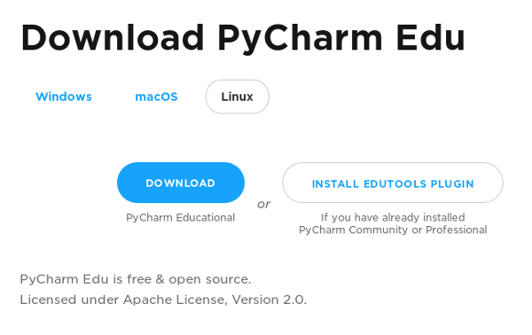
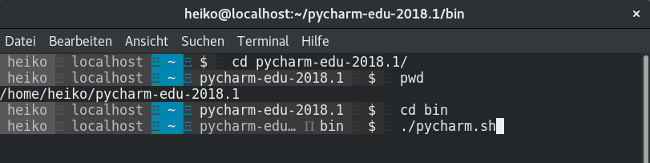

# Installation

Bevor wir **Pycharm Edu** starten können, wird das Programm heruntergeladen und installiert.

* Starte einen Webbrowser und öffne folgende Webseite: [Pycharm Edu - Download](https://www.jetbrains.com/pycharm-edu/download)

* Klicke auf den blauen Download-Button und entpacke die Archiv-Datei in ein beliebiges Verzeichnis.

Mehr ist für Installation nicht notwendig. Anschließend kann **Pycharm Edu** in der Kommandozeile gestartet werden.

* Öffne ein Terminal-Programm, wechsle ins pycharm-Verzeichnis und gib folgende Befehle ein:


cd bin
./pycharm.sh


 
Beispiel:

